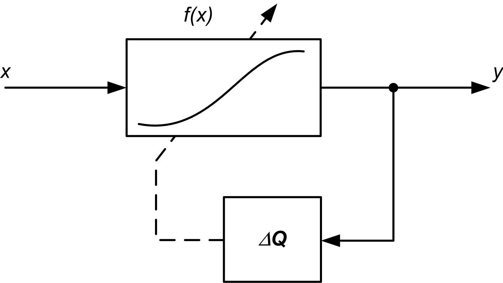
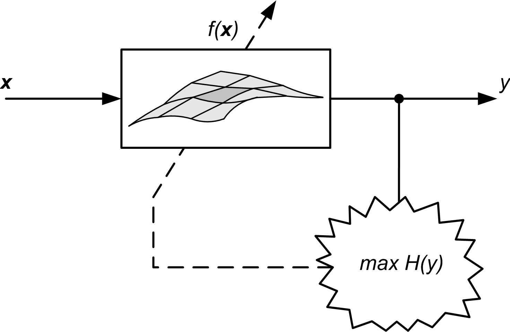

# Flexible-PDF-estimation

This repository presents the software used to estimate the cumulative density funtion (CDF) and the probability density function (PDF) of random variables by using a LUT interpolated by cubic splines [1]. The bidimensional version, for estimating joint CDF and joint PDF by using bidimensional splines [2], is also presented.
The software is available for both MATLAB and Python languages.

Specifically, the main idea of the proposed approach is based on the well-known Infomax principle composed of a nonlinear function $f(x)$, which is implemented in a flexible manner by a cubic spline interpolation. This because we are interested in changing the shape of the nonlinearity during the learning process. When the algorithm converges the shape of this nonlinear function is matching the CDF of the input random vector.

## The mono-dimensional case
The estimation of the mono-dimensional CDF is achieved through the system shown in the following Figure, which involves a monotone increasing continuous function $y = f(x)$.

The implementation of the flexible function $f(x)$ is reached by a spline interpolation scheme. Splines are smooth parametric curves defined by interpolation of properly defined control points collected in a lookup table (LUT). In the general case, given $N$ equispaced control points, the spline curve results as a polynomial interpolation through $N-3$ adjacent spans. Let $y = f(x)$ be some function to be estimated. The spline estimation provides an approximation $f(x) \cong \widetilde{y} = \widehat{f}\left( u(x), i(x) \right)$ based on two parameters ($u,i$) directly depending on $x$:

$$\bar{y} = f(\bar{x}) = \widehat{f}\left( u(\bar{x}), i(\bar{x}) \right) = \mathbf{T} \mathbf{M} \mathbf{Q}_i,$$

where $\mathbf{T} = \left[u^3, u^2, u, 1\right]$, $`\mathbf{Q}_i = \left[q_i, q_{i+1}, q_{i+2}, q_{i+3}\right]^\top`$ is the vector that collects the local control points and $\mathbf{M}$ is a $4 \times 4$ matrix which selects which spline base is used, typically B-Spline or Catmull-Rom spline (CR-Spline).

In order to ensure the monotonously increasing characteristic of the overall function, the additional constraint $q_i < q_{i+1}$ must be imposed.

The learning algorithm is derived by maximizing the output entropy of the system by using the previous expression for the function $f(x)$. The learning rule, exploting the gradient ascent, is local and involves the adaptation of only four control points for each input sample.

## The bi-dimensional case
The estimation of the bi-dimensional CDF is achieved through the system shown in the following Figure, which involves a monotone increasing continuous and bi-dimensional function $y = f(\mathbf{x}) = f(x_1, x_2)$.

The implementation of the flexible function $f(x_1, x_2)$ is reached by a  generalized spline interpolation scheme. Let $y=f(x_1,x_2)$ be a function to be estimated. In the general case, given $N^2$ control points equispaced on a regular grid of dimension $N$, the spline surface results as a concatenation of local $(N-3)^2$ adjacent surfaces. The spline estimation provides an approximation $f(x_1, x_2) \cong \widetilde{y} = \widehat{f}\left( u_1, u_2, i_1, i_2 \right)$ based on two pairs of parameters ($u_1,i_1$) and ($u_2,i_2$) directly depending on $x_1$ and $x_2$:

$$\bar{y} = f(\bar{x}_1, \bar{x}_2) = \mathbf{T}_2 \mathbf{M} \left( \mathbf{T}_1 \mathbf{M} \mathbf{Q}_{i_1, i_2} \right)^\top,$$

where $\mathbf{T}_k = \left[u_k^3, u_k^2, u_k, 1\right]$, $k = 1,2$, $\mathbf{Q}_{i_1,i_2}$ is the matrix that collects the local control points $q_{i,k}$ and $\mathbf{M}$ is a $4 \times 4$ matrix which selects which spline base is used, typically B-Spline or Catmull-Rom spline (CR-Spline).

In order to ensure the monotonously increasing characteristic of the overall function, the additional constraint $q_{i,k} < q_{i+1,k}$ must be imposed.

The learning algorithm is derived by maximizing the output entropy of the system by using the previous expression for the function $f(x_1,x_2)$. The learning rule, exploting the gradient ascent, is local and involves the adaptation of only sixteen control points for each couple of input sample.

## References
1. M. Scarpiniti, R. Parisi and A. Uncini, "Flexible estimation of probability and cumulative density functions", *Electronics Letters*, Vol. 45, N. 21, 2009.
2. M. Scarpiniti, R. Parisi and A. Uncini, "Flexible estimation of joint probability and joint cumulative density functions", *Electronics Letters*, Vol. 46, No. 15, p. 1084-1086, July 2010.
